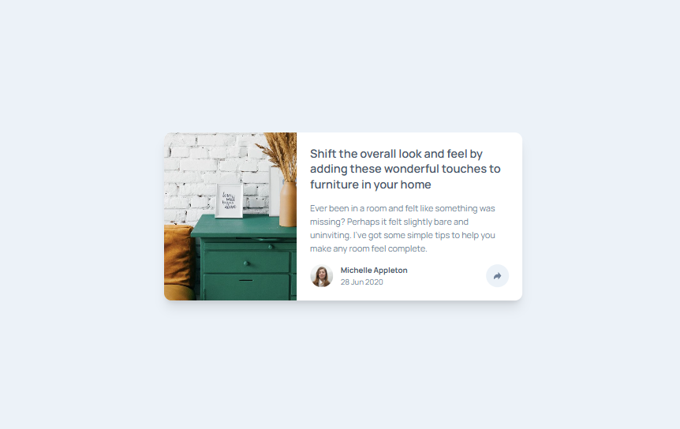

# Frontend Mentor - Article preview component solution

This is a solution to the [Article preview component challenge on Frontend Mentor](https://www.frontendmentor.io/challenges/article-preview-component-dYBN_pYFT). Frontend Mentor challenges help you improve your coding skills by building realistic projects.

## Table of contents

- [The challenge](#the-challenge)
- [Screenshot](#screenshot)
- [Links](#links)
- [Built with](#built-with)
- [What I learned](#what-i-learned)
- [Continued development](#continued-development)
- [Author](#author)

### The challenge

Users should be able to:

- View the optimal layout for the component depending on their device's screen size
- See the social media share links when they click the share icon

### Screenshot



### Links

- Solution URL: [Add solution URL here](https://www.frontendmentor.io/solutions/article-preview-component-spI6_aFAXT#comment-695a3ffea3afd01f28854515)
- Live Site URL: [live site URL here](https://jeanclaude09-dev.github.io/article-preview-component-master/)

### Built with

- Semantic HTML5 markup
- CSS custom properties
- Tailwind css
- JavaScript

### What I learned

- Tailwind uses `w-full` by default on images and block element
- Using fixed width like `w-[750px]` is not a good practice

- Arrow function besides looking good, they make easy the use parameter and using the key word "function"

```js
shareBtn.addEventListener("click", () => {
  tooltip.classList.toggle("opacity-0");
  tooltip.classList.toggle("scale-95");
  tooltip.classList.toggle("translate-y-1");
});
```

### Continued development

- Event listener and DOM manipulation

## Author

- Frontend Mentor - [@jeanclaude09-dev](https://www.frontendmentor.io/profile/jeanclaude09-dev)
- Twitter - [@iamjeanclaude09](https://www.twitter.com/iamjeanclaude09)
- Github - [@jeanclaude09-dev](https://github.com/Jeanclaude09-dev)
